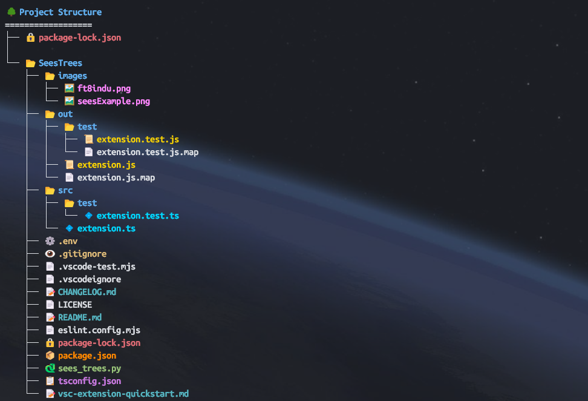

# SeesTrees

SeesTrees is a Visual Studio Code extension that provides a visually enhanced, color-coded, and emoji-rich tree view of your project directory structure. Instantly understand your project's hierarchy at a glance, right from the terminal or command palette.

## Features
- Beautiful tree view of your project structure
- Color coding for file types (Python, JS, configs, docs, images, etc.)
- Emojis for instant file/folder recognition
- Ignores clutter (e.g., .git, node_modules, build artifacts)
- Easy to use from the command palette or terminal

## Requirements
- Visual Studio Code 1.100.0 or higher
- No additional dependencies

## Extension Settings
This extension does not add any custom settings. All configuration is automatic and based on common project conventions.

## Known Issues
- Large projects may take longer to render
- Permission errors on restricted folders are gracefully handled

## Release Notes
### 0.0.8
- Fixed compatibility issues with VS Code
- Enhanced file type detection with more comprehensive emoji mapping
- Improved sorting and display of files and folders
- Added refresh command for tree view

### 0.0.6
- Initial release: project tree visualization with color and emoji support

## Contributing
Contributions and feedback are welcome! Please open an issue or pull request on the project repository.

## License
MIT
